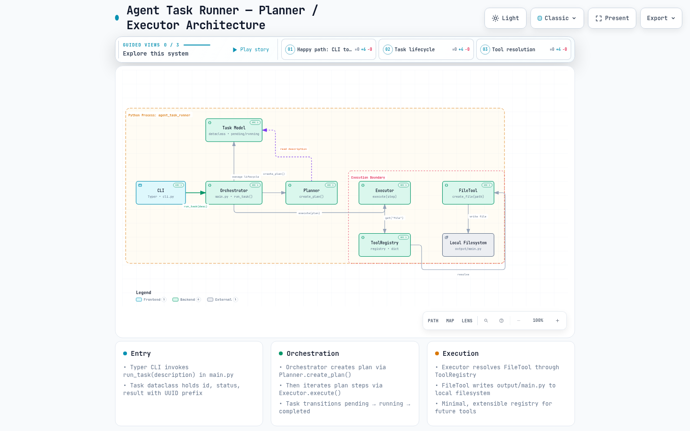

# Agent Task Runner

> একটি ন্যূনতম Planner / Executor প্যাটার্নের টাস্ক রানার — বর্ণনা থেকে পরিকল্পনা, পরিকল্পনা থেকে ফাইল তৈরি পর্যন্ত স্বয়ংক্রিয় প্রবাহ।

[](https://www.python.org/)
[](https://typer.tiangolo.com/)
[](pyproject.toml)
[](agent-task-runner.html)

**প্রজেক্ট:** `agent-task-runner` v0.1.0 | **রিপোজিটরি:** `github.com/dev-sajid007/task-planner-agent`

---

## সূচিপত্র

- [পরিচিতি](#পরিচিতি)
- [বৈশিষ্ট্য](#বৈশিষ্ট্য)
- [প্রয়োজনীয়তা](#প্রয়োজনীয়তা)
- [দ্রুত শুরু](#দ্রুত-শুরু)
- [ব্যবহার](#ব্যবহার)
- [আর্কিটেকচার](#আর্কিটেকচার)
- [প্রজেক্ট কাঠামো](#প্রজেক্ট-কাঠামো)
- [ডকুমেন্টেশন সূচি](#ডকুমেন্টেশন-সূচি)
- [অবদান](#অবদান)
- [লাইসেন্স](#লাইসেন্স)

---

## পরিচিতি

**Agent Task Runner** একটি শিক্ষামূলক, এক্সটেনসিবল টাস্ক রানার। ব্যবহারকারী একটি স্বাভাবিক ভাষার বর্ণনা দেন, সিস্টেম তা থেকে ৩ ধাপের পরিকল্পনা তৈরি করে এবং প্রতিটি ধাপ `ToolRegistry` এর মাধ্যমে উপযুক্ত টুল দিয়ে কার্যকর করে।

**মূল প্রবাহ:**

```
বর্ণনা (description) → Task তৈরি → Planner.create_plan() → Executor.execute() → FileTool.create_file() → output/main.py
```

উদাহরণ: `"একটি লগইন পেজ তৈরি করো"` দিলে প্ল্যান হয়:
1. `Understand task: ...`
2. `create_file: output/main.py`
3. `Verify result`

এই সরলতা ইচ্ছাকৃত — নতুন টুল (যেমন `http_tool`, `db_tool`) যোগ করতে শুধু `ToolRegistry` এ রেজিস্টার করলেই হয়।

## বৈশিষ্ট্য

- **৩-স্তর আর্কিটেকচার:** `CLI → Orchestrator → Planner/Executor → Tools`
- **Task লাইফসাইকেল:** `pending → running → completed/failed`, `uuid4[:8]` আইডি — `src/agent_task_runner/task.py:6`
- **এক্সটেনসিবল Registry:** `ToolRegistry` — `register/get/has` — `src/agent_task_runner/registry/tool_registry.py:1`
- **FileTool:** `pathlib.Path` দিয়ে নিরাপদ ফাইল তৈরি — `src/agent_task_runner/tools/file_tool.py:4`
- **Typer CLI:** `task-runner` কমান্ড — `src/agent_task_runner/cli.py:8`
- **ইন্টারঅ্যাকটিভ ডায়াগ্রাম:** Archify showcase — `agent-task-runner.html`

## প্রয়োজনীয়তা

- Python `>=3.11`
- `uv` (প্রস্তাবিত) অথবা `pip`
- নির্ভরতা: `typer>=0.27.2` — `pyproject.toml:10`

## দ্রুত শুরু

```bash
# 1. ক্লোন
git clone https://github.com/dev-sajid007/task-planner-agent.git
cd task-planner-agent

# 2. পরিবেশ তৈরি (uv প্রস্তাবিত)
uv sync
# অথবা
python -m venv .venv && source .venv/bin/activate
pip install -e .

# 3. চালানো — CLI
uv run task-runner "একটি হ্যালো ওয়ার্ল্ড ফাইল তৈরি করো"
# অথবা সরাসরি
task-runner "Create a hello world file"

# 4. Python API হিসেবে
uv run python -c "from agent_task_runner.main import run_task; run_task('demo task')"
```

**আউটপুট উদাহরণ:**

```
Task ID: a1b2c3d4
Task: একটি হ্যালো ওয়ার্ল্ড ফাইল তৈরি করো
Status: pending

Plan:
1. Understand task: একটি হ্যালো ওয়ার্ল্ড ফাইল তৈরি করো
2. create_file: output/main.py
3. Verify result

Status: running

Execution:
Executing: Understand task: ...
Executing: create_file: output/main.py
Executing: Verify result

Status: completed
Result: Task executed successfully.
```

ফলাফল: `output/main.py` ফাইল তৈরি হয়।

## ব্যবহার

সংক্ষিপ্ত — বিস্তারিত দেখুন [docs/USAGE.md](docs/USAGE.md):

```bash
# সাহায্য
task-runner --help

# কাস্টম বর্ণনা
task-runner "output/docs/README.md ফাইল তৈরি করো"
```

```python
from agent_task_runner.main import run_task
from agent_task_runner.task import Task

task = run_task("ডেটা প্রসেসিং স্ক্রিপ্ট তৈরি করো")
print(task.status)  # completed
print(task.result)  # Task executed successfully.

# Task সরাসরি
t = Task("পরীক্ষা")
t.start()
t.complete("done")
t.fail("error")  # ব্যর্থতার ক্ষেত্রে
```

নতুন টুল যোগ:

```python
from agent_task_runner.registry.tool_registry import ToolRegistry

registry = ToolRegistry()
registry.register("mytool", MyTool())
tool = registry.get("mytool")
```

## আর্কিটেকচার

ইন্টারঅ্যাকটিভ ডায়াগ্রাম: **[agent-task-runner.html](agent-task-runner.html)** — `candidate.architecture.json` থেকে Archify showcase রেন্ডার।



**৮টি কম্পোনেন্ট:**

| কম্পোনেন্ট | ধরন | ফাইল | ভূমিকা |
|---|---|---|---|
| CLI | frontend | `cli.py:8` | Typer এন্ট্রি, `run_task()` কল |
| Orchestrator | backend | `main.py:6` | Task ও Planner/Executor সমন্বয় |
| Task Model | backend | `task.py:6` | dataclass, `pending/running/completed` |
| Planner | backend | `planner/planner.py:1` | `create_plan()` — ৩ ধাপ |
| Executor | backend | `executor/executor.py:5` | `execute(step)`, Registry resolve |
| ToolRegistry | backend | `registry/tool_registry.py:1` | `dict` ভিত্তিক রেজিস্ট্রি |
| FileTool | backend | `tools/file_tool.py:4` | `create_file(path)` |
| Local Filesystem | external | `output/main.py` | চূড়ান্ত আউটপুট |

**২টি Boundary:** `Python Process: agent_task_runner` (region), `Execution Boundary` (security-group: executor+registry+filetool)

**৮টি Connection:** `run_task(desc)` → `manage lifecycle` → `create_plan()` → `execute(plan)` → `get("file")` → `resolve` → `write file` + `read description` (dashed)

বিস্তারিত: [docs/ARCHITECTURE.md](docs/ARCHITECTURE.md) — ৩টি guided view (happy-path, task-lifecycle, tool-resolution) সহ।

## প্রজেক্ট কাঠামো

```
agent-task-runner/
├── src/agent_task_runner/
│   ├── cli.py                 # Typer CLI — run_agent_task
│   ├── main.py                # Orchestrator — run_task()
│   ├── task.py                # Task dataclass
│   ├── planner/planner.py     # Planner.create_plan()
│   ├── executor/executor.py   # Executor.execute()
│   ├── registry/tool_registry.py
│   └── tools/file_tool.py
├── docs/
│   ├── ARCHITECTURE.md
│   ├── INSTALLATION.md
│   ├── USAGE.md
│   └── API.md
├── agent-task-runner.html     # Archify ইন্টারঅ্যাকটিভ ডায়াগ্রাম
├── candidate.architecture.json
├── pyproject.toml
└── README.md
```

## ডকুমেন্টেশন সূচি

| ডক | বর্ণনা |
|---|---|
| [docs/INSTALLATION.md](docs/INSTALLATION.md) | ইনস্টলেশন — uv/pip, .venv, যাচাই |
| [docs/USAGE.md](docs/USAGE.md) | CLI ও Python API ব্যবহার, উদাহরণ |
| [docs/ARCHITECTURE.md](docs/ARCHITECTURE.md) | আর্কিটেকচার গভীর বিশ্লেষণ, ডায়াগ্রাম |
| [docs/API.md](docs/API.md) | মডিউল ভিত্তিক API রেফারেন্স |
| [CONTRIBUTING.md](CONTRIBUTING.md) | অবদান নির্দেশিকা (বাংলা) |
| [CHANGELOG.md](CHANGELOG.md) | পরিবর্তন লগ |

## অবদান

অবদান স্বাগত! দেখুন [CONTRIBUTING.md](CONTRIBUTING.md) — ব্রাঞ্চ, কমিট, PR নিয়ম বাংলায়।

```bash
git checkout -b feat/my-tool
uv run python -m pytest  # টেস্ট থাকলে
git commit -m "feat: mytool যোগ"
```

## লাইসেন্স

এই প্রজেক্ট বর্তমানে লাইসেন্স ফাইল ছাড়া — প্রয়োজনে `LICENSE` যোগ করুন। লেখক: `dev-sajid007` — `dev.sajid007@gmail.com`

---

> **নোট:** কোড আইডেন্টিফায়ার, কমান্ড, পাথ (`Task`, `create_plan()`, `output/main.py`, `task-runner`) ইংরেজিতেই রাখা হয়েছে। ডকুমেন্টেশনের ব্যাখ্যা বাংলায়, Viewer UI ইংরেজি।
