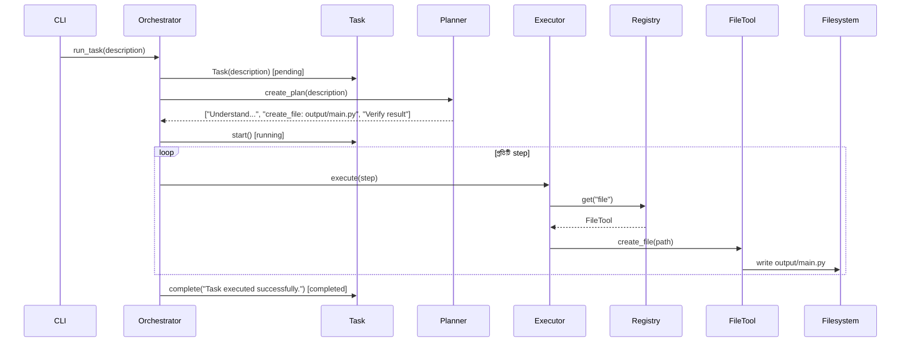

# আর্কিটেকচার — Agent Task Runner

> Planner / Executor প্যাটার্নের ন্যূনতম বাস্তবায়ন — ৮ কম্পোনেন্ট, ২ boundary, ৮ connection

**ডায়াগ্রাম:** [`../agent-task-runner.html`](../agent-task-runner.html) (Archify showcase, viewBox 1280×680)  
**স্পেসিফিকেশন:** [`../candidate.architecture.json`](../candidate.architecture.json) — `quality_profile: showcase`, `sha256: 8e6a04d1537ea808fc8d2ec7fc476be60a672c33d67f804e1784680473b89983`  
**রিপোজিটরি:** `github.com/dev-sajid007/task-planner-agent @ c93b4be1`

---

## ১. সারসংক্ষেপ

```
CLI (Typer) → Orchestrator (main.run_task) → Planner.create_plan() → Executor.execute() → ToolRegistry → FileTool → Local Filesystem
                     ↕
                Task Model (pending → running → completed/failed)
```

Orchestrator (`src/agent_task_runner/main.py:6`) হলো কেন্দ্র — সে `Task` তৈরি করে, `Planner` থেকে plan নেয়, `Executor` দিয়ে প্রতিটি step চালায়, এবং `Task` এর status আপডেট করে।

---

## ২. কম্পোনেন্ট বিবরণ

| # | ID | লেবেল | ধরন | ফাইল ও লাইন | অবস্থান | ভূমিকা |
|---|---|---|---|---|---|---|
| 1 | `cli` | CLI | frontend | `src/agent_task_runner/cli.py:8` | [40,320] | Typer কমান্ড `run_agent_task(task: str)`, `run_task()` কল |
| 2 | `orchestrator` | Orchestrator | backend | `src/agent_task_runner/main.py:6` | [240,320] | `run_task(description)` — Task, Planner, Executor সমন্বয় |
| 3 | `task` | Task Model | backend | `src/agent_task_runner/task.py:6` | [240,140] | `@dataclass Task` — `id/status/result/error`, `start/complete/fail` |
| 4 | `planner` | Planner | backend | `src/agent_task_runner/planner/planner.py:1` | [470,320] | `create_plan(task) -> list[str]` — ৩ ধাপের fixed plan |
| 5 | `executor` | Executor | backend | `src/agent_task_runner/executor/executor.py:5` | [680,320] | `execute(step)` — prefix পার্স, Registry থেকে tool resolve |
| 6 | `registry` | ToolRegistry | backend | `src/agent_task_runner/registry/tool_registry.py:1` | [680,470] | `dict` ভিত্তিক, `register/get/has/list_tools` |
| 7 | `filetool` | FileTool | backend | `src/agent_task_runner/tools/file_tool.py:4` | [920,320] | `create_file(path, content="")` — `Path.mkdir+write_text` |
| 8 | `filesystem` | Local Filesystem | external | `output/main.py` | [920,470] | চূড়ান্ত আউটপুট, external entity |

**নোট:** সব `pos` ও `size` Archify viewBox 1280×680 এর মধ্যে; `viewBox` কমিয়ে 760→680 করা হয়েছে 1440×900 containment pass করার জন্য।

---

## ৩. Boundary

| Kind | লেবেল | Wraps | উদ্দেশ্য |
|---|---|---|---|
| `region` | `Python Process: agent_task_runner` | `cli, orchestrator, task, planner, executor, registry, filetool` | একই Python প্রসেসের ভিতরের কম্পোনেন্ট |
| `security-group` | `Execution Boundary` | `executor, registry, filetool` | টুল কার্যকর করার নিরাপদ সীমানা, ভবিষ্যতে permission/sandbox |

`filesystem` ইচ্ছাকৃতভাবে region এর বাইরে — এটি external I/O।

---

## ৪. Connection — ৮টি সম্পর্ক

| ID | From → To | লেবেল | Variant | Route | ব্যাখ্যা |
|---|---|---|---|---|---|
| `cli-to-orch` | `cli → orchestrator` | `run_task(desc)` | emphasis | auto, `labelDy:52` | CLI থেকে Orchestrator কল, main path |
| `orch-to-task` | `orchestrator → task` | `manage lifecycle` | default | `top→bottom`, `labelDx:34` | Task তৈরি ও status নিয়ন্ত্রণ |
| `orch-to-planner` | `orchestrator → planner` | `create_plan()` | default | auto, `labelDy:-42` | পরিকল্পনা চাওয়া |
| `orch-to-exec` | `orchestrator → executor` | `execute(plan)` | default | `bottom→bottom`, via `[321,410],[754,410]`, `labelDy:14` | planner-কে bypass না করে নিচের করিডোর দিয়ে — `planner` ক্রস এড়াতে |
| `exec-to-registry` | `executor → registry` | `get("file")` | default | `bottom→top`, `labelAt:[782,428]` | Registry থেকে tool খোঁজা |
| `registry-to-filetool` | `registry → filetool` | `resolve` | default | `right→right`, via `[860,503],[860,574],[1100,574],[1100,353]`, `labelAt:[980,590]` | ডান দিক থেকে ডান দিকে — `filesystem` ক্রস এড়াতে বাইরের করিডোর |
| `filetool-to-fs` | `filetool → filesystem` | `write file` | default | `bottom→top`, `labelAt:[1022,424]` | ফাইল লেখা |
| `planner-reads-task` | `planner → task` | `read description` | dashed | `top→right`, via `[544,250],[440,250],[440,173]` | Planner task বর্ণনা পড়ে, dashed = read-only |

**জ্যামিতি নোট:** `orch-to-exec` ও `registry-to-filetool` এ explicit `via` ব্যবহার করা হয়েছে — Archify validate এ `edge-through-node` ও `label-route-clearance` এরর এড়াতে। সব label `labelDy/labelDx/labelAt` দিয়ে component overlap মুক্ত।

---

## ৫. Guided Views (৩টি)

`candidate.architecture.json:12-31` এ সংজ্ঞায়িত:

1. **happy-path** — `cli, orchestrator, planner, executor, filetool, filesystem` — CLI থেকে ফাইল পর্যন্ত প্রধান প্রবাহ
2. **task-lifecycle** — `orchestrator, task, planner, executor` — Task `pending → running → completed` ট্রানজিশন
3. **tool-resolution** — `executor, registry, filetool, filesystem` — Registry resolve প্রবাহ

HTML Viewer-এ উপরে View সুইচ করে ফোকাস করা যায়।

---

## ৬. সিকোয়েন্স (রানটাইম)



সোর্স: `main.py:6-36`, `executor.py:12-24`, `file_tool.py:6-11`

---

## ৭. ডিজাইন সিদ্ধান্ত

| সিদ্ধান্ত | কারণ | বিকল্প |
|---|---|---|
| **Fixed 3-step plan** | শিক্ষামূলক, deterministic | LLM-based dynamic plan (ভবিষ্যত) |
| **Dict Registry** | সরল, টেস্টযোগ্য | Service locator / DI container |
| **FileTool শুধু write** | MVP — একটিই side-effect | Read, Delete, Append যোগ |
| **Task dataclass** | lightweight, `uuid4[:8]` | Pydantic / DB model |
| **Bottom করিডোর via** | `planner` ক্রস না করে `orchestrator→executor` | `planner→executor` সরাসরি (কিন্তু orchestrator দায়িত্ব হারায়) |

---

## ৮. ভবিষ্যৎ সম্প্রসারণ

- নতুন টুল: `registry.register("http", HttpTool())` — `executor.py:10` এ রেজিস্টার প্যাটার্ন অনুসরণ
- Async Executor — `execute()` কে `async` করা
- Plan validation — `create_plan` এর আউটপুট স্কিমা চেক
- Persistence — `Task` কে DB/ফাইলে সংরক্ষণ

---

> **ফাইল রেফারেন্স:** সব `path:line` `candidate.architecture.json` এর `sources` থেকে যাচাইকৃত — `--repo-root` সহ `archify validate --quality showcase` pass।
